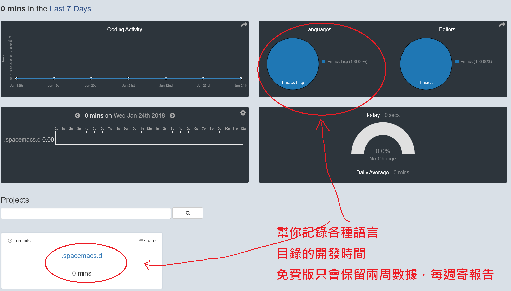

    {:title "Emacs 中使用 wakatime 追蹤開發時間" :layout :post :tags ["emacs" "wakatime"] :toc false}

# 　

## 　

最近在使用 elfeed 的功能，就順道看了 Spacemacs 的其他 Web Services layer

然後想說慢慢來用看看，今天先嘗試的是 wakatime

簡單的介紹可以參考 [ WakaTime - 编程时间管理工具 顺便秀秀编程时间 | Jing’s Blog ](http://www.iamlj.com/2016/07/recommend-tools-wakatime/)

在 windows 上面安裝需要留意一些事情

首先是要用 `Run as Administer` 開啟 cmd

然後安裝

    pip install wakatime

接下來使用 Spacemacs 的說明中提到的設定

    ;; 在 dotspacemacs-configuration-layers 中新增
    (wakatime :variables
                    wakatime-api-key  "<註冊完帳號就會有API-KEY>"
                    ;; use the actual wakatime path
                    wakatime-cli-path "<可不填,只要python套件在環境變數中>")

這邊的 API-KEY 在註冊完畢 wakatime 就會得到，需要驗證 email

而 Path 的話則是不用輸入，因為在 Windows 上面處理 path 會很麻煩，有斜線問題

如果你的 python 安裝路徑本身就在環境路徑下，那就不用添加 path

如果你 wakatime 沒執行成功，他會在 Emacs 的 `*messages*` buffer 告訴你他想執行的指令

像我剛改完畢 Spacemacs 設定，馬上就更新到 wakatime 網站了

## 參考資料

1.  [ WakaTime - 编程时间管理工具 顺便秀秀编程时间 | Jing’s Blog ](http://www.iamlj.com/2016/07/recommend-tools-wakatime/)
2.  [spacemacs/layers/+web-services/wakatime at master · syl20bnr/spacemacs · GitHub](https://github.com/syl20bnr/spacemacs/tree/master/layers/%2Bweb-services/wakatime)
